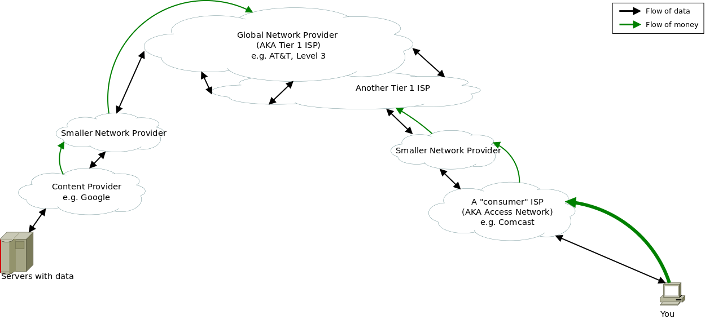
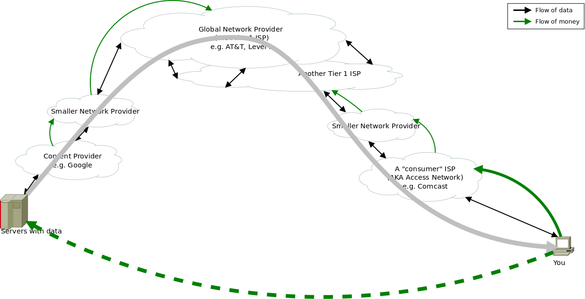
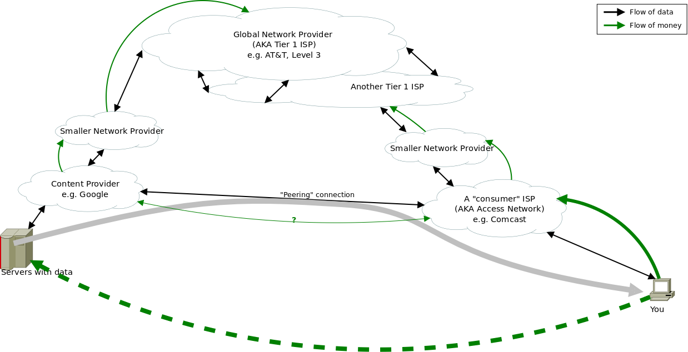
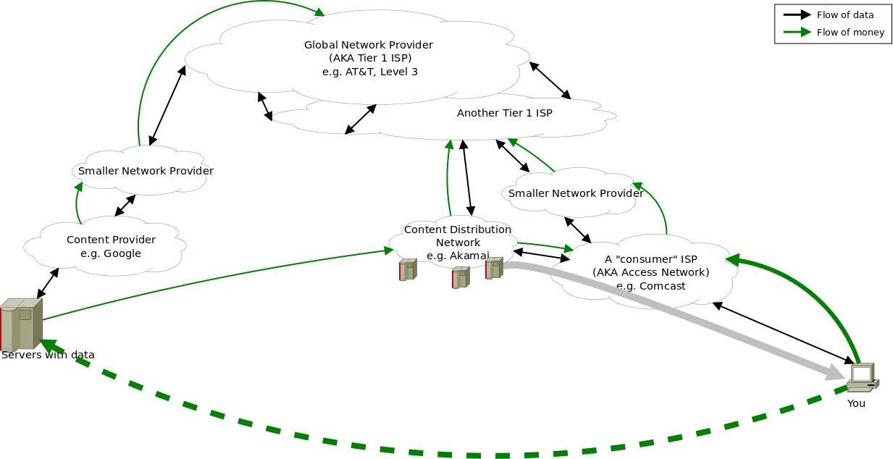

* Blah
{:toc}

# The Internet, Simplified
 
This picture shows a somewhat simplified view of who the players are in the current internet, and how they interact.  Clouds are networks belonging to a particular company. Black arrows show the flow of traffic, green arrows show the flow of money.

Broadly speaking, there are a few truly global network providers (called \"Tier 1 ISPs\") and they cary very large quantities of data all over the world.  Almost everyone else is directly or indirectly their customer.
 
The internet service providers that consumers deal with (access ISPs) provide two main services:  They operate a \"last mile\" network that connects your house to their central network, and they effectively re-sell connectivity to the rest of the Internet through their upstream provider(s).   Basically everything but the access ISP is a reasonably competitive market.  There are many providers and resellers, and robust price competition.  The cost of \"transit\" data is coming down by a factor of [about 30% per year](http://drpeering.net/white-papers/Internet-Transit-Pricing-Historical-And-Projected.php), meaning that it's almost 100 times cheaper now than it was ten years ago.  The access ISP market is much less competitive.   Reasonable estimates are that it costs an ISP [about $400 per house](http://arstechnica.com/tech-policy/2010/03/fiber-its-not-all-created-equal/) to install a cable, and there\'s a huge amount of back-end infrastructure.  That means that many markets only have a single broadband ISP, and very few have more than a couple.  So the end user often faces a situation in which his or her ISP has a near-mononpoly.  Additionally, from the perspective of a content provider, the end-user\'s ISP has a *complete* monopoly on connection to that user.  A web company can\'t go around Comcast to do business with an end user on Comcast\'s network.

## Accessing Content

Now, suppose you want to do business with a web-based company.  The next figure shows the flow of data and money involved.  In general, both you and they are paying for the network capacity to carry your data, and then you\'re also paying them directly for whatever service they provide.

The most basic (economic) concern is that ISPs can extract \"monopoly rent\" from the you or the content provider.  They know that you want to access Netflix, and somebody\'s making money off that, and they\'d like a cut.  In the simplest form, the ISP could tell the customer (you) \"Netflix is blocked until you pay our $5/month Netflix surcharge.\"  It\'s important to note that the amount of money the ISP asks for *need not have anything to do with what it actually costs to carry the data*. In a total monopoly, there would be no other way for you to get that data, so they could charge anything they wanted, up to the total value (to the customer) of Netflix.

Now, the ISPs don\'t really want to do that, either, because you do often have *some* choice, and there\'s no point pissing off their customers.  But if they demand payment from Netflix instead of you, the problem\'s solved.  Netflix can\'t change your ISP, so if they want to do business with you, they have to pay your ISP whatever it asks.  The ISP\'s only limitation is that if you, the customer, notice problems and blame the ISP, then again you might have an incentive to switch.  There are a million ways the ISP could degrade your connection to Netflix without actually telling you \"hey, we\'re blocking this\" and those are what we worry about in practice.  All of this stuff has happened in the past with telephone service, and much of the current tangle of telecommunications law came from trying to prevent such things.

# Challenges

There are a few things that make it harder to define what a \"network neutrality violation\" really looks like. 

## Variations

There are lots of subtle alternatives to directly blocking a service and demanding a ransom.  They work out about the same, but are harder to prove, and harder to forbid without also banning useful innovations.  Here are a couple:

1.  Don\'t block, just slow traffic to a service.  In this case, it\'s not obvious to the end user why the performance is bad, but it reduces the quality of their experience enough hurt the business, who then has an incentive to pay up.

2.  Don\'t block (or slow) a service, just a technology.  There are million ways to effectively degrade a particular service without explicitly singling it out.  For example, an ISP could discriminate against streaming video (in general) instead of Netflix specifically.

3.  Don\'t extort, just compete.  Maybe charging a shakedown fee would be forbidden (or look bad).  No problem, an ISP can get the same result by blocking or degrading someone else\'s service while offering their own marked-up alternative.

4.  Don\'t degrade, just don\'t improve.  Technology  and network operations practice are improving all the time.  If an ISP improves most of its network, but not the parts that would benefit some particular service, that disadvantages the service without ever explicitly degrading it.

From my perspective as a technologist, 2 and 3 are possibly worse than the straight-up block.  In an effort to slightly obscure what\'s happening on the business side of things, they change the technology side.  That could make it harder to do something new and worthwhile, even if it has nothing to do with the business fight.

## Optional Improvements

If an ISP is only connected to the rest of the Internet through its upstream provider(s), it\'s probably mostly true that any content provider will have a \"fair\" connection to the ISP\'s customers, unless the ISP itself is actively trying to discriminate.

It gets tricky, though, because there are several things that ISPs can do to improve performance relative to the previous pictures.  These are all good things to do, but they selectively improve the connection between an ISP and some other specific network.   That means that, by doing these things or declining to do so, an ISP can favor or disfavor a content provider without *explicitly* treating their traffic differently.  Here are a couple of big ones: 

### Peering
{:.no_toc}

In the previous figures, all of the connections between networks (except for the Tier 1s) were customer-provider relationships.  In those cases, it\'s clear-cut who\'s paying whom.  Whether they\'re sending or receiving data, the customer is purchasing the service from the provider, and they pay for it.  Sometimes, though, it makes sense for networks which aren\'t in a customer-provider relationship to directly connect.  For example, suppose Google and Comcast can talk to each other directly and cut out the middlemen of their upstream providers.   Depending on the technical details, that might very well deliver better performance  and/or lower costs.   The next figure shows such a connection.  Frequently, such arrangements are \"settlement free\" -- both companies save money, both companies get better performance for themselves or their customers, and neither compensates the other.  But not always.

If the ISP doesn\'t feel like peering with a content provider, should
they be under any obligation to do so?  If not, an ISP can effectively
degrade service to the content provider by not peering, not
maintaining a sufficient generic non-peered \"transit\" connection for
the traffic, and then selectively making alternate arrangements for
the content providers they *don\'t* want to degrade.  If the ISP does
have an obligation to peer, then under what terms?  Can the ISP charge the content provider?  If so, how much?  If they can demand arbitrarily high payment, that\'s pretty much equivalent to not having to peer.  If not, how is an acceptable rate calculated, and by whom?

### Content Delivery Networks
{:.no_toc}

Another \"optional improvement\" is content delivery networks.  Frequently, when you interact with a large web service, (some of) the data you get isn\'t coming from their central servers.  To provide better service -- and possibly save money on bandwidth -- companies use what are called \"Content Distribution Networks\" or CDNs.  These have many servers spread around the world, and they try to handle users\' requests using nearby servers, instead of having to serve everyone from a single location.

CDNs actively work with ISPs to create good connections for their customers.  If a CDN wants to offer the best performance to *e.g.* Comcast\'s customers in New York, it\'s not enough to have a server in New York.  The CDN will want to peer with Comcast, and directly connect its New York servers to Comcast\'s New York network.  The CDN server might even by physically located inside the ISP\'s premises.  The issues are essentially the same as with peering:  Does an ISP have to do business with CDNs?  Can an ISP \"encourage\" a CDN not to serve data for a particular content provider?  If the ISP operates its own CDN, does it have to offer that service on a non-discriminatory basis to all content providers?  If not, can the ISP degrade or neglect its non-CDN capacity until content providers have to pay up?

## \"Good Discrimination\"

The principle of network neutrality is often stated as \"your ISP has to treat all data the same way\" but that may be an overly-strict requirement.  There are beneficial technical reasons to treat different packets differently.  A classic example is that voice calls are very sensitive to network delay and variability.  If there\'s much delay, conversation doesn\'t feel natural, and if there\'s much variability, you get interruptions and glitches and bad sound quality.  Voice calls also don\'t use a lot of bandwidth.  A large file download has opposite characteristics:  Small delays and variation barely matter, but it benefits from having as much total bandwidth as possible.  As a customer, you want your ISP (and the rest of the internet) to prioritize your voice packets:  Giving them preferential treatment improves your voice experience, and most of your other application won\'t even notice the difference.  And we\'d probably like to prioritize 911 calls over in-game chat services, even though they\'re both voice and likely have very similar technical requirements.

## Oversubscription

One argument ISPs make for charging content providers is \"they\'re using our network capacity, they should pay for it.\"  At first blush, this sounds dumb.  It even is dumb: The ISP\'s end users pay for connection to the Internet, and the ISP uses that revenue to pay for its own network and to pay its upstream providers.  Content providers don\'t send data onto an ISP\'s network unless it\'s going to the ISP\'s customer, who\'s paying for it.  But, there\'s also a sense it which it\'s true:  ISPs generally don\'t bill for actual usage, presumably because customers prefer the simplicity of a flat fee.  That means they get paid whether you use their network a little or a lot.  But their costs *do* depend on how much you use:  The capacity needed on their upstream connection and internal network based on average usage.  (Average here doesn\'t necessarily mean the mean, but it\'ll be some function of the aggregate use across all customers, which will be influenced by each customer\'s average).   ISPs therefore build their networks (and contract for upstream service) based on how heavily they think you\'ll use the network, not the maximum you possibly could.

That\'s called \"oversubscription,\" and it\'s not a bad thing in itself:  As a customer, it\'s nice to have a high peak bandwidth available when I want it, without paying what it would cost if I and everyone else continuously used that much.  But it creates a tension: The ISP has every incentive to sell you a very high *potential* bandwidth, and hope you don\'t use it very much.  And any time something happens that changes customers\' Internet habits (especially the ratio between peak and average usage), that changes how much oversubscription an ISP can get away with.  And apparently it\'s better PR to say \"Netflix is using up our bandwidth\" than to say \"Hey, we didn\'t think you\'d want to use your \`unlimited\' service as much as you are, we\'re going to have to upgrade our infrastructure and raise the price to cover it.\"

# Recommendations

What\'s the solution?  I don\'t claim to know.  I\'m a computer scientist, not a regulator or an economist.  Here are a few principles that make sense to me, but they could be wrong:

0.  Last-mile ISPs are what I\'m concerned about.  Core Internet service is a different beast.

1.  Non-discrimination and transparency in inter-ISP or ISP-content-provider interconnect agreements:  The same peering, co-location, etc. services should be available at the same price to anyone.  This needs to exclude nominally-technical criteria that \"happen\" to treat content providers differently from other networks.

2.  No conflict of interest (or careful supervision):  If an ISP offers services other than pure data transport, and those services are in competition with what\'s available over the public Internet, the onus should be on the ISP to demonstrate that they are not in any way disadvantaging the public Internet relative to their own offerings.

3.  Clearly-delineated performance guarantees in ISP-customer marketing and contracts:  *e.g.* How much *actual* bandwidth can the customer expect to the core Internet and/or specific destinations?  With what probability will the customer see that performance?  If there are caps or throttling on individual usage, what exactly is the allowed rate?

4.  End-user-controlled prioritization:  If different packets are prioritized or treated differently, that should be under the control of the customer.

# References

## Technical
  * [Dr. Peering](http://drpeering.net/white-papers/An-Internet-Peering-White-Papers-Index.html):  A great set of references on the technical and business sides of inter-ISP connections.  Mostly written for a network operator audience.  See especially: [The 21st Century Internet Peering Ecosystem](http://drpeering.net/core/ch10.2-The-21st-Century-Internet-Peering-Ecosystem.htm) and [Access Power Peering](http://drpeering.net/AskDrPeering/blog/articles/Ask_DrPeering/Entries/2011/9/6_Access_Power_Peering.html).

## News
  * [Comcast is destroying the principle that makes a competitive internet possible](http://www.vox.com/2014/5/6/5678080/voxsplaining-telecom/in/5451297):  This is obviously an essay with an opinion.  It's also a pretty good discussion.
  * [Beyond net neutrality: The new battle for the future of the internet](http://www.vox.com/2014/5/2/5665890/beyond-net-neutrality-the-new-battle-for-the-future-of-the-internet):  Another essay by Tim Lee, with pretty animations.
  
# About
My name is [Eric Anderson](http://www.cs.cmu.edu/~andersoe), and I wrote this in an attempt to add a little bit of technical nuance to the discussion of network neutrality.  I am a computer scientist, but this is not my area of expertise within the field.  (Update:  I wrote this in 2014, when I was CMU faculty.  I moved to a government position in 2016, but these are my own personal thoughts and not those of my employer).
